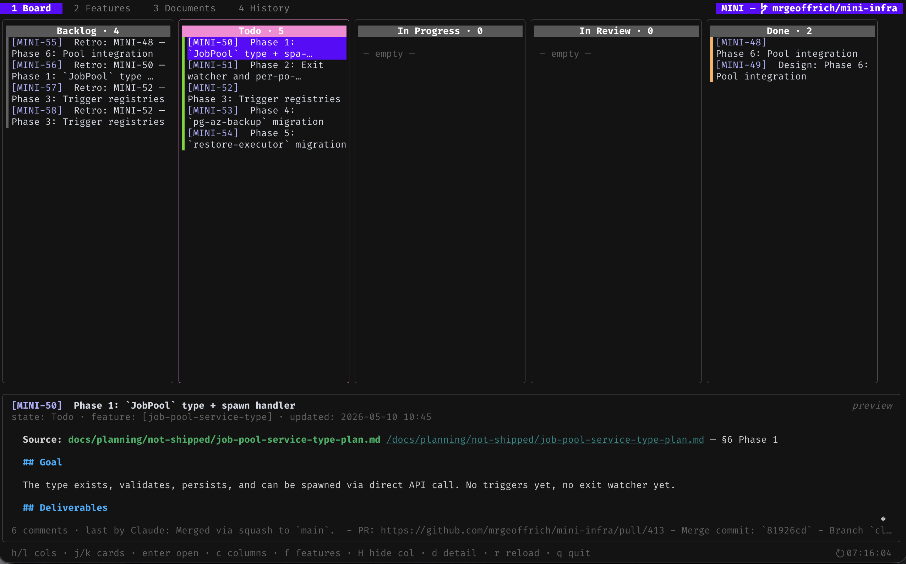
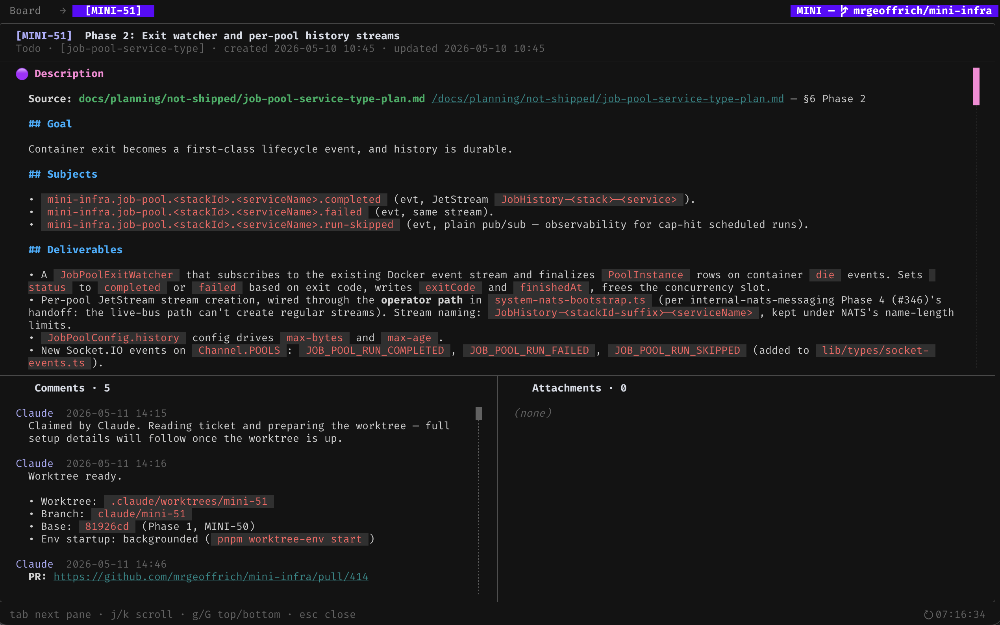
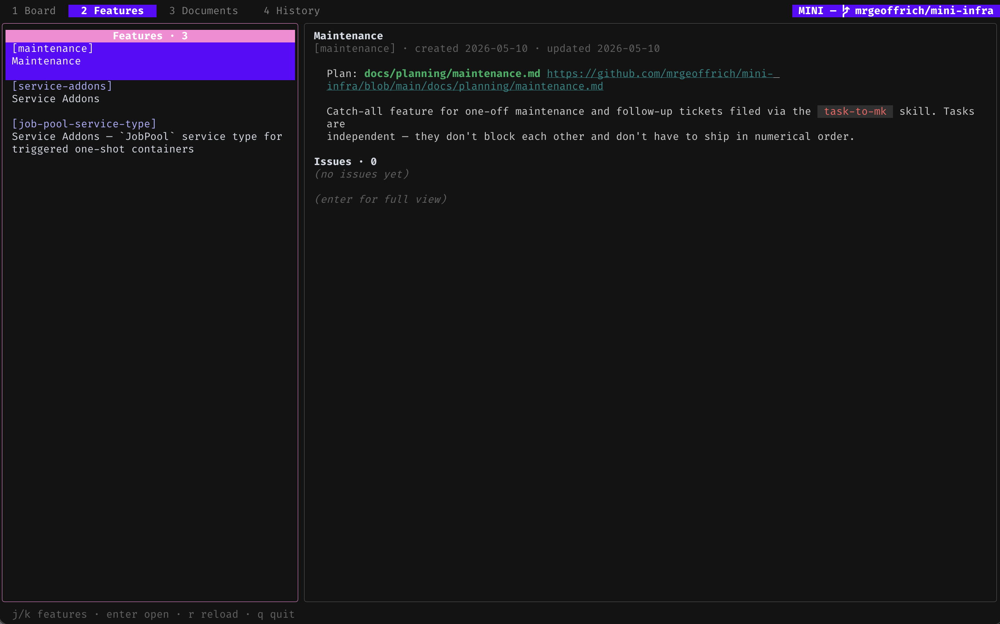
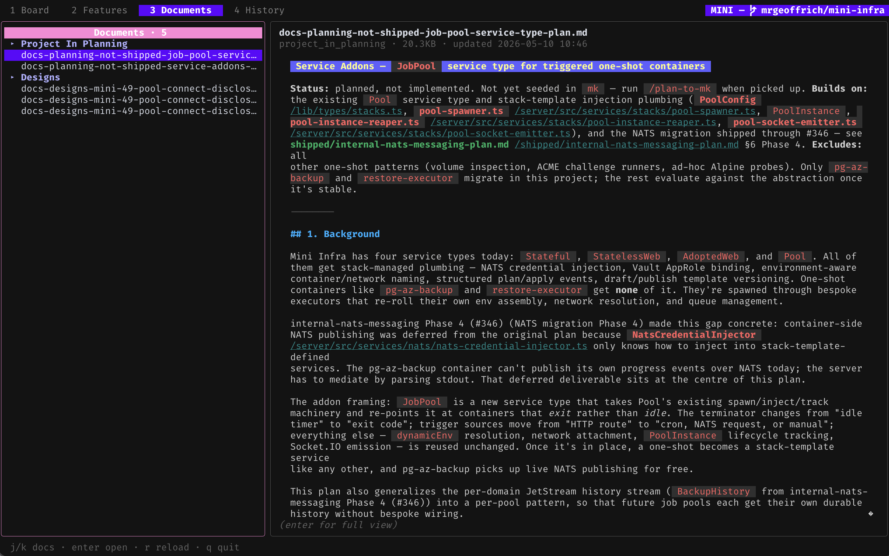
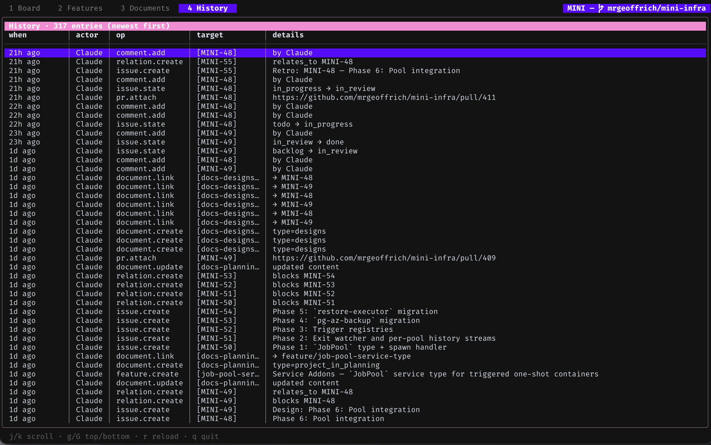

# bacio - [*BAH-choh*](#how-do-you-say-it)

> "kiss" in Italian; more importantly its a chocolate-hazelnut gelato flavour.

Sick of dealing with bloated tooling and vendors to manage your work?

Bacio is a totally free local first kanban board for _anyone_. **Claude/Codex does the work, you orchestrate it.**

You talk to Claude Code or Codex; it does the typing — files issues, updates state, breaks features into tasks, answers questions about your board. You mostly *read* — on the CLI (`bacio issue list`) , in the TUI (`bacio tui`) or in your favourite editor (Vscode/Zed/Vim).

<p align="center">
  
</p>

## Install

**Homebrew** (macOS and Linux, prebuilt binaries):

```bash
brew tap mrgeoffrich/bacio
brew install bacio
```

## Quick start

```bash
cd ~/your-project
bacio init                # creates a 4 letter prefix for this project
bacio install-skill       # teaches Claude Code how to drive bacio
```

Now open Claude Code / Codex and say:

> File an issue: the login page 500s on Safari when the password contains a `&`.

The AI does the rest — picks a title, picks tags, files the ticket, hands you back the key.

For the full walk-through — first session, sample skills, multi-machine sync — see **[docs/getting-started.md](docs/getting-started.md)**.

## Read the board

```bash
cd ~/your-project
bacio tui
```

A full-screen kanban with four tabs — Board (above), Features, Docs, History — all keyboard driven. `?` shows the bindings for the focused tab, `q` (or `esc`) exits. Open any card for the full description and comments, or jump to the other tabs:

<p align="center">
  
  
  
  
</p>

## How do I work on different machines with a local database? Can I view issues in my favourite editor?

You might want to view all the issues, documents and features using your favourite editor instead of via the TUI. And you might work across a number of devices. You can enable sync to a git repository for all contents to keep a central working copy of everything.

`bacio sync` mirrors the DB to a folder of YAML + markdown in a separate git repo — handy for browsing the board in your editor, diffing changes over time, or sharing a board across machines.

1. **Create an empty git repo for the sync data.** On GitHub:

```bash
gh repo create your-project-bacio-sync --private
```

Any empty git remote works (GitLab, Gitea, a bare repo on a server you control); the contents are human readable plain text.

2. **From inside your project, set it up:**

```bash
bacio sync init ~/your-project --remote https://github.com/you/your-project-bacio-sync.git
```

This creates `~/sync/your-project` with one file per issue, feature, and document, commits, and pushes. It also writes `.bacio/config.yaml` inside your project (check it in) so future `bacio sync` calls — and other machines via `bacio sync clone` — know which remote to use.

3. **Keep it in sync as you work:**

```bash
bacio sync                # pull → import → export → commit → push
```

Run it whenever — pushes your writes, pulls anyone else's. Multi-machine setup, conflict semantics, and the inspect/verify tools live in [docs/getting-started.md](docs/getting-started.md#5-sync-across-machines-when-youre-ready).

## Why bacio

- **Built for LLMs.** The CLI reads return JSON. CLI updates/writes take JSON. Every payload schema is reachable at runtime via `bacio schema`. The bundled skill (`bacio install-skill`) is the single source of truth for agents.
- **Local-first.** Your board starts life as a single SQLite DB file. Nothing leaves the laptop until you run `bacio sync`.
- **Auditable.** Every mutation records who, when, and what changed. (claude knows to pass `--user claude` so the log attributes correctly.)
- **Optional sync.** Want the same board on a laptop and a desktop? `bacio sync init`, plain git underneath.
- **Optional REST API.** `bacio api` puts the CLI behind HTTP — handy for web UIs, IDE plugins, long-running agents.

## Project status

Solo-maintained, used in anger by its author. Contributions welcome — see `CLAUDE.md` for development conventions, and `docs/tui-cookbook.md` for the bubbletea/lipgloss patterns the TUI relies on.

## How do you say it?

<p align="center">
  <video src="https://github.com/user-attachments/assets/aa83c41d-1e9a-4053-89cc-2c0773fd9044" controls></video>
</p>

## License

MIT — see [LICENSE](LICENSE).
